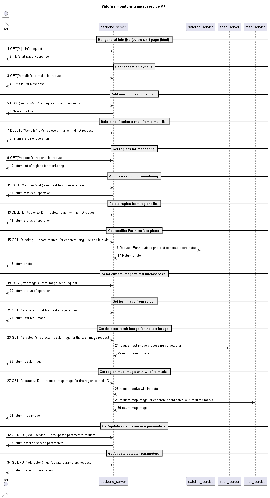
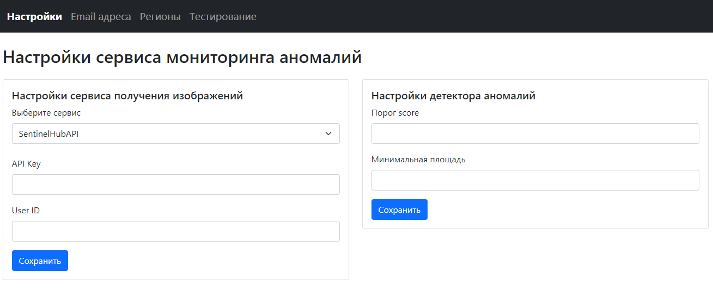
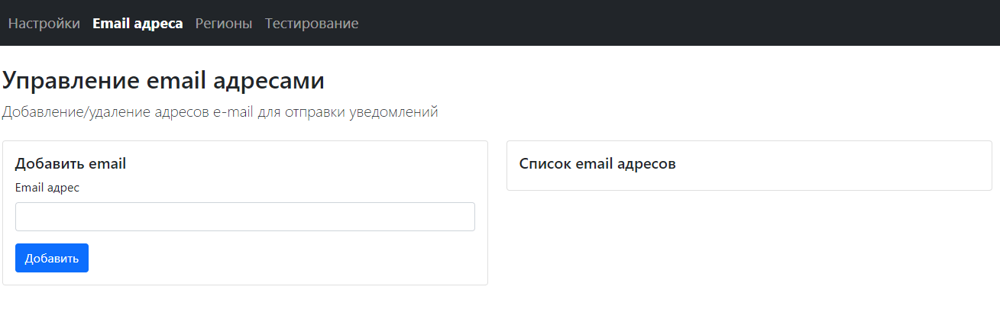
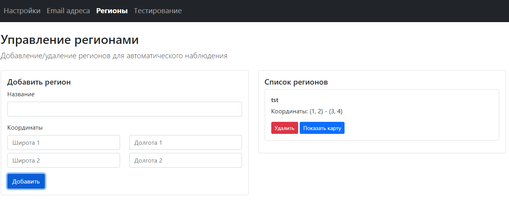
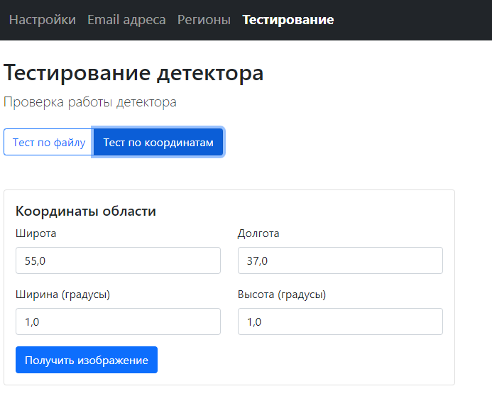
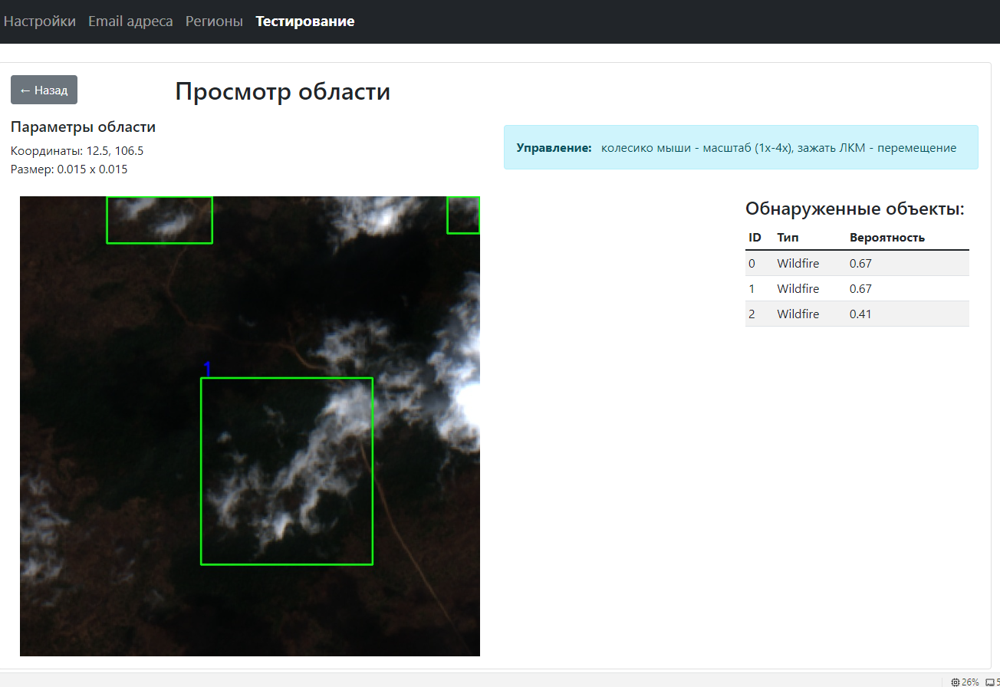

# wildfire_sat_finder
Проект по обнаружению лесных пожаров по снимкам из космоса в рамках хакатона ТГУ.

Проект содержит 2 приложения: веб микросервис по поиску лесных пожаров и
приложение для тестирования ИИ моделей детектирования.

Описание приложения для тестирования моделей подробно описано тут: [Тестирование моделей ИИ](/app-prototype-streamlit/README.md)

При работе микросервиса были использованы спутниковые сервисы: НАСА (https://api.nasa.gov/planetary/earth/imagery)
и SentinelHUB.
Для взаимодействия с сервисом НАСА был написан модуль запроса данных через http запросы.
Для взаимодействия с сервисом SentinelHUB использовалась python библиотека sentinelhub, 
предоставляемая сервисом.

Для детектирования была использована модель YOLO8, натренированная на платформе Roboflow.
Модуль детектора микросервиса использует платформу Roboflow в качестве вычислительного сервиса для работы
с ИИ моделью детектирования объектов YOLO8.
Примененная модель находится на платформе по адресу: https://universe.roboflow.com/wildfire-kwxfu/wildfire-tksrf

Прототип сервиса https://huggingface.co/spaces/ZDenis/WildfireDetectorSatelite
Датасет:
- https://huggingface.co/datasets/ZDenis/WildfireDetectorSateliteDataset-COCO
- https://universe.roboflow.com/dewfe2f3f23f/wildfire-detector-satelite
Модели:
- https://huggingface.co/ZDenis/WildfireDetectorSatelite-YOLOv8
- https://huggingface.co/ZDenis/WildfireDetectorSatelite-YOLOv11
- https://huggingface.co/ZDenis/WildfireDetectorSatelite-ResNet-101
- https://huggingface.co/ZDenis/WildfireDetectorSatelite-ResNet-152
- https://huggingface.co/ZDenis/WildfireDetectorSatelite-ResNet-50

## Установка

### Последовательность установки веб микросервиса

Для работы модели использован интерпретатор Python3.11.
1. Установите виртуальное окружение и зависимости. Запустите командную строку в скаченной папке web сервера и выполните:  
   • python -m venv env  
   • env\Scripts\activate  
   • pip install -r requirements.txt
2. Запустите web-сервер, в виртуальном окружении выполните: uvicorn app.main:app
3. Для работы с программой в браузере откройте http://127.0.0.1:8000
4. Для запуска тестирования endpoints в терминале набрать: python tests/test_endpoints.py
### Docker
docker build -t wildfire-detection .
docker compose up -d

## Описание работы
Микросервис имеет API json интерфейс и html интерфейс. Взаимодействие между 
пользователем и элементами микросервиса описан следующей диаграммой:

1. Get general info (json)/view start page (html)

При выполнении этого запроса в формате json выдается краткое описание микросервиса. При выполнении этого запроса в
html формате выдается стартовая html страница сервиса.

2. Get notification e-mails

При выполнении этого запроса в формате json выдается список e-mail адресов для уведомлений сервиса. При выполнении 
этого запроса в html формате отображается страница со списком e-mail адресов для уведомления.

3. Add new notification e-mail

При выполнении этого запроса сервис добавляет новый e-mail адрес в список адресов
для уведомления.

4. Delete notification e-mail from e-mail list

При выполнении этого запроса удаляется заданный e-mail адрес из списка адресов
для уведомления.

5. Get regions for monitoring

При выполнении этого запроса в формате json выдается список регионов для атоматического сканирования
на предмет пожаров. При выполнении этого запроса в формате html выдается страница со списком сохраненных
регионов для автоматического сканирования.

6. Add new region for monitoring

При выполнении этого запроса в список регионов для автоматического сканирования добавляется новый регион.

7. Delete region from regions list

При выполнении этого запроса из списка сохраненных для автоматического сканирования
регионов удаляется заданный регион.

8. Detect wildfire on the satellite Earth surface photo

При выполнении этого запроса в формате json микросервис запрашивает изображение через спутниковый сервис,
отправляет его на детектор, а в результате выдает изображение, закодированное в
base64, с нанесенными рамками обнаруженных пожаров, а также метрики детектора по обнаруженным объектам.
При выполнении этого запроса в формате html выдается страница с изображением, на котором нанесены рамки обнаруженных пожаров,
а также с таблицей метрик детектора по обнаруженным объектам.

9. Send custom image to test microservice

При выполнении этого запроса микросервис сохраняет переданное вместе с запросом изображение
на диск.

10. Get test image from server

При выполнении этого запроса в формате json микросервис передает сохраненное
ранее изображение. Если такового нет на диске, то выдается сообщение об ошибке.

11. Get detector result image for the test image

При выполнении этого запроса в формате json микросервис выдает изображение, закодированное в
base64, с нанесенными рамками обнаруженных пожаров, а также метрики детектора по обнаруженным объектам.
При выполнении этого запроса в формате html выдается страница с изображением, на котором нанесены рамки обнаруженных пожаров,
а также с таблицей метрик детектора по обнаруженным объектам.

12. Get region map image with wildfire marks

Задумано, что по этому запросу будет выдаваться кусок карты местности с нанесенными метками пожаров.
В данный момент не реализовано.

13. Get/update satellite service parameters

Запрос текущих параметров спутникового сервиса или задание новых.

14. Get/update detector parameters

Запрос текущих параметров детектора или задание новых.

### Автоматическое описание API сервиса

Микросервис имеет автоматическое описание API в формате swagger ui.
Для открытия swagger ui нужно зайти на страницу "/docs"

## Описание html интерфейса микросервиса

html интерфейс реализован с применением шаблонизатора jinja и скриптов java.

Интерфейс имеет удобную панель навигации между разделами, расположенную вверху страницы.

Внешний вид интерфейса представлен на рисунке:

При открытии начальной страницы открывается раздел с настройками микросервиса.
На этой странице можно выбрать один из доступных спутниковых сервисов и 
настроить параметры доступа к нему (форма слева), а также настроить параметры детектора (форма справа).

В разделе email адреса реализовано управление адресами для уведомлений:
добавление новых и удаление ненужных:

В разделе Регионы реализовано управление регионами для автоматического сканера:
добавление новых и удаление ненужных:

В разделе тестирование возможно загрузить в микросервис свое изображение из файла
для проверки работы детектора, а также запросить изображение со спутникового
сервиса и проверить работу детектора на нем:

При нажатии кнопки "Получить изображение" открывается страница с результатом
работы детектора по выбранному изображению:
