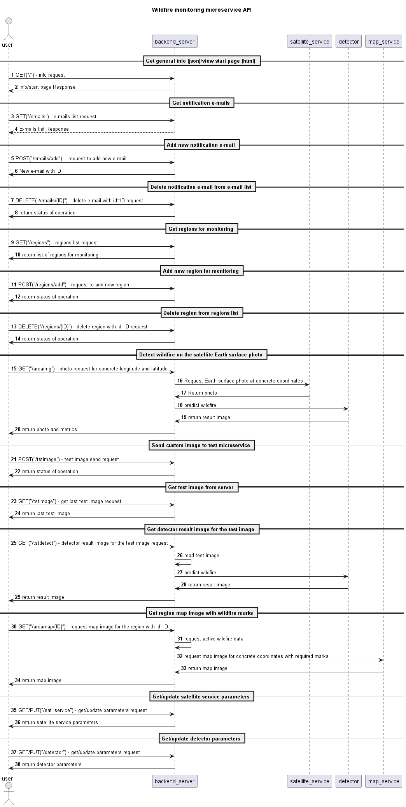

# wildfire_sat_finder
Проект по обнаружению лесных пожаров по снимкам из космоса в рамках хакатона ТГУ.

## Установка

Для работы модели использован интерпретатор Python3.11.

1. Установите виртуальное окружениеие и зависимости. Запустите командную строку в скаченной папке web сервера и выполните:  
• python -m venv env  
• env\Scripts\activate  
• pip install -r requirements.txt  
2. Запустите web-сервер, в виртуальном окружении выполните: uvicorn app.main:app  
3. Для работы с программой в браузере откройте http://127.0.0.1:8000 
4. Для запуска тестирования endpoints в терминале набрать: python tests/test_endpoints.py
### Docker
docker build -t wildfire-detection .
docker compose up -d

### Последовательность установки
Для установки используемых библиотек нужных версий выполните команду в рабочей папке проекта:

pip install -r requirements.txt.

## Описание работы
Микросервис имеет API json интерфейс и html интерфейс. Взаимодействие между 
пользователем и элементами микросервиса описан следующей диаграммой:

